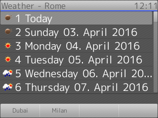
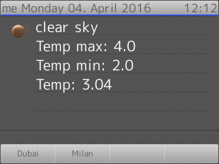
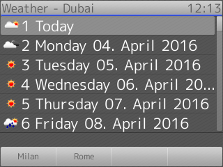

# Snom OpenWeatherMap.org integration

[OpenWeatherMap.org](http://openweathermap.org/) offers a feature rich weather web API.

This Python script is an integration example between OpenWeatherMap and Snom phones: using this script you can generate an XML application showing current weather and the 6-days forecast over a list of Cities or locations.

### Usage

* First of all you have to register on [OpenWeatherMap.org](http://openweathermap.org/) in order to obtain an API key.
* Then you have to clone this repository
* Install **pyowm**: this script requires the [PyOWM](https://github.com/csparpa/pyowm) library witch can be installed via `pip install pyowm`.
* Run the script in order to generate the XML file, here you can see the available options (*-k* and *-u* are required).

```
Usage: update-weather.py [OPTIONS]

Options:
  -h, --help  show this help message and exit
  -u APP_URL  Set the application URL
  -c CITY     Set the city to retrieve, you can add more the one -c <city>
  -k API_KEY  The OpenWeatherMap.org API Key
  -p          Your API key belongs to a pro account
```

* Serve the generated file trough a web server, if you want to quickly test the application you can use the python builtin web server: `python -m SimpleHTTPServer`

#### Usage in a Docker container

This repo provides also a ready to use Dockerfile in order to run the script in a self-contained Docker container without the need to install PyOWM into the host machine:

1. Build the container image: `docker build -t owm-py .`
1. Run the script into the container: `docker run -it --rm owm-py -u http://10.16.0.108:8000/weather.xml -k xxxxAPI-KEYxxxx -c Rome -c Milan -c Dubai > weather.xml`
1. Serve the XML file: `python -m SimpleHTTPServer`

### Screenshots

**Rome forecast main view:**



**Rome today weather:**



**Dubai forcast main view:**


