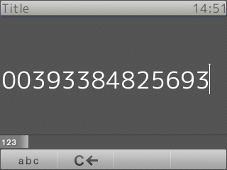
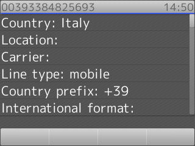

# Numverify integration

This small PHP script retrieves the number details from [Numverify](https://numverify.com) using the public APIs.

## Usage

1. You have to register an account on [Numverify](https://numverify.com) in order to get an API key.
1. Change the `api_key` variable according to your Numverify API key.
1. Add the `numverify.php` in your web server (PHP must be enabled)
1. Setup your Snom phone in order to retrieve the PHP script

## Screenshots

**Number input:**

**Resul:**

